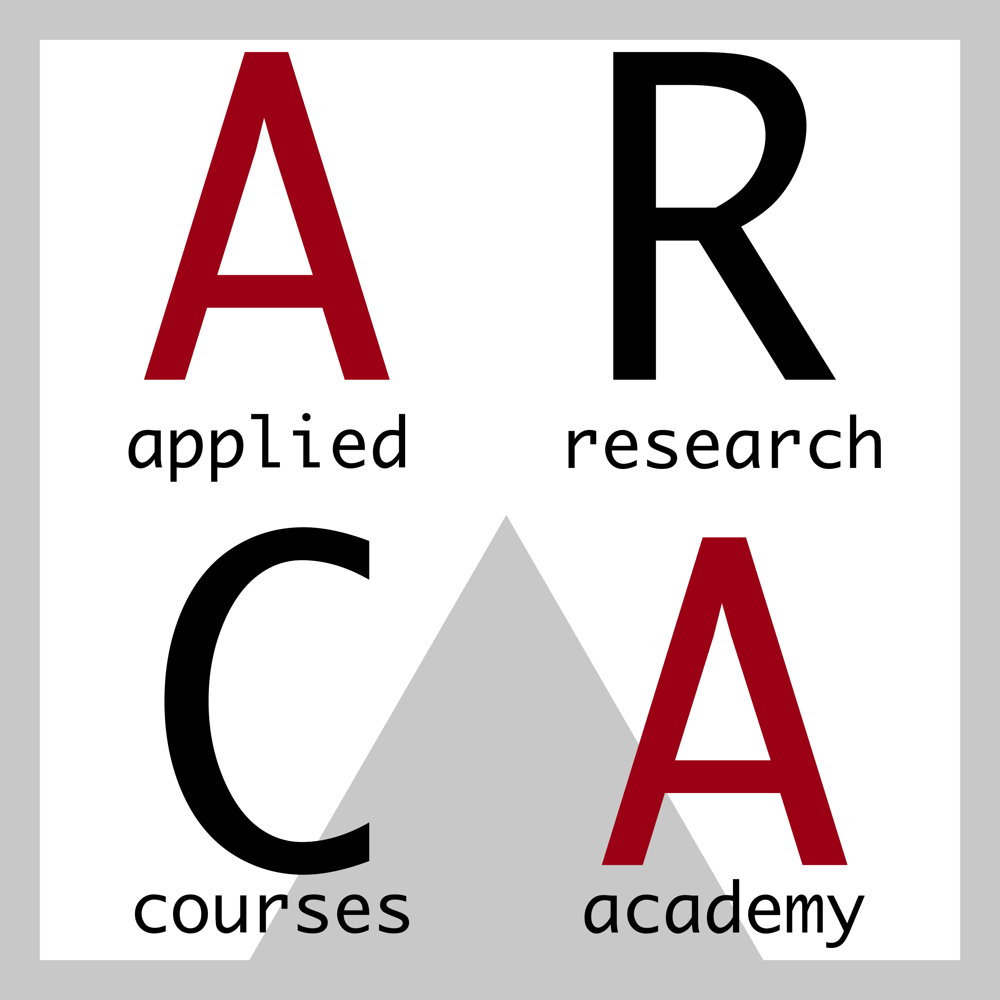
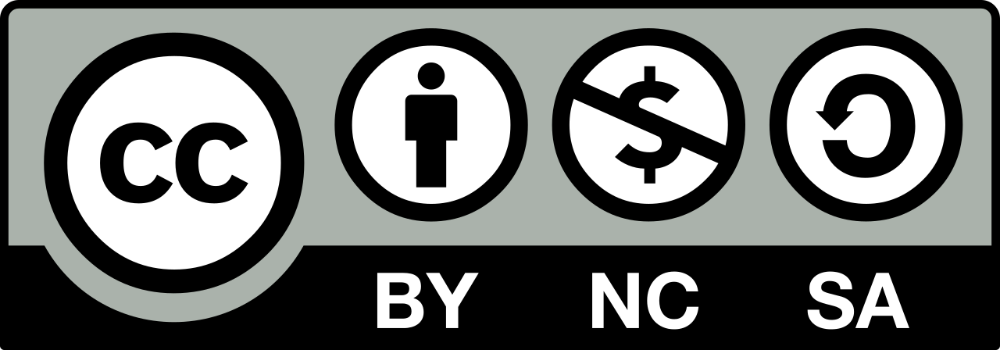

--- 
title: "The Open Science Manual"
subtitle: "Make Your Scientific Research Accessible and Reproducible"
author: |
  [Claudio Zandonella Callegher](https://claudiozandonella.netlify.app/) and 
  [Davide Massidda](https://www.linkedin.com/in/davidemassidda/)
date: "`r paste(format(Sys.time(), '%d %B, %Y'), ' [last-updated]')`"
site: bookdown::bookdown_site
documentclass: book
bibliography: ["assets/bib/manual-open-science.bib", "assets/bib/packages.bib"]
csl: "assets/bib/apa.csl"
link-citations: yes
github-repo: "arca-dpss/manual-open-science"
description: |
  The present book aims to describe programming good practices and introduce common tools 
  used in software development to guarantee reproducibility of the analysis results. 
  We want to make scientific research an open-source knowledge development.
cover-image: "assets/images/arca-logo.png"
header-includes: 
  - \usepackage{titlepic}
  - \titlepic{\includegraphics[width=.8\textwidth]{images/arca-logo.pdf}}
url: 'https\://arca-dpss.github.io/manual-open-science/'
fontsize: 11pt
---
\mainmatter
\pagestyle{myfancy}

```{r settings, echo=FALSE, message=FALSE}
library(tidyverse)
library(kableExtra)
library(ggplot2)

# Chunks settings
knitr::opts_chunk$set(echo = FALSE,
                      # Plot settings
                      # dev = "tikz",
                      dev.args=list(pointsize=12), fig.align='center',
                      fig.pos = "h", dpi = 300,

                      # Code output width
                      # tidy=TRUE, tidy.opts = list(width.cutoff = 75),
                      # comment = NA, prompt = TRUE,
                      
                      collapse = TRUE,

                      # Cache options
                      cache = FALSE, autodep=TRUE)

# Format
output_format <- ifelse(knitr::is_html_output(), 
                        yes = "html", no = "latex")

# Console output width

if(output_format == "latex"){
  options(width = 75)
} else {
  options(width = 200)
}

# Option KableExtra
options(knitr.kable.NA = '')
options(knitr.table.format = output_format)

# Load custom functions
devtools::load_all()

## ggplot settings
theme_set(theme_classic()+
            theme(text = element_text(size=12)))
```

# Preface {-}

> Science is one of humanity's greatest inventions. Academia, on the other hand, is not. It is remarkable how successful science has been, given the often chaotic habits of scientists. In contrast to other fields, like say landscaping or software engineering, science as a profession is largely *unprofessional* - apprentice scientists are taught less about how to work responsibly than about how to earn promotions. This results in ubiquitous and costly errors. Software development has become indispensable to scientific work. I want to playfully ask how it can become even more useful by transferring some aspects of its professionalism, the day-to-day tracking and back-tracking and testing that is especially part of distributed, open-source software development. Science, after all, aspires to be distributed, open-source knowledge development.
>
> "Science as Amateur Software Development" @richardmcelreathScienceAmateurSoftware2020  
>
> https://youtu.be/zwRdO9_GGhY

Inspired by McElreath's words, this book aims to describe programming good practices and introduce common tools used in software development to guarantee the reproducibility of analysis results. We want to make scientific research an open-source knowledge development.

The book is available online at https://arca-dpss.github.io/manual-open-science/.

A PDF copy is available at https://arca-dpss.github.io/manual-open-science/manual-open-science.pdf.

## Book Summary {-}

In the book, we will learn to:

- Share our materials using the **Open Science Framework**
- Organize project files and data in a well structured and documented **Repository**
- Write readable and maintainable code using a **Functional Style** approach
- Use **Git** and **GitHub** for tracking changes and managing collaboration during the development
- Use dedicated tools for managing the **Analysis Workflow** pipeline
- Use dedicated tools for creating **Dynamic Documents**
- Manage project requirements and dependencies using **Docker**

As most researchers have no formal training in programming and software development, we provide a very gentle introduction to many programming concepts and tools without assuming any previous knowledge.

Examples and specific applications are based on the R programming language. However, this book provides recommendations and guidelines useful for any programming language.

## About the Authors {-}

During our careers, we both moved into the field of Data Science after a PhD in Psychological Sciences. This book is our attempt to bring back into scientific research what we have learned outside of academia.

- [Claudio Zandonella Callegher](https://claudiozandonella.netlify.app/) (claudiozandonella@gmail.com). During my PhD, I fell in love with data science. Understanding the complex phenomena that affect our lives by exploring data, formulating hypotheses, building models, and validating them. I find this whole process extremely challenging and motivating. Moreover, I am excited about new tools and solutions to enhance the replicability and transparency of scientific results.
- [Davide Massidda](https://www.linkedin.com/in/davidemassidda/) (d.massidda@kode-solutions.net).

## ARCA {-}



ARCA courses are advanced and highly applicable courses on modern tools for research in Psychology. They are organised by the Department of Developmental and Social Psychology at the University of Padua.

## Contribute {-}

Surely there are many typos to fix and new arguments to include. Anyone is welcome to contribute to this book. For small typos just send a pull request with all the corrections. To propose new chapters or paragraphs, instead, open an issue to discuss and plan them.

View book source at GitHub repository https://github.com/arca-dpss/manual-open-science.

## Cite {-}

For attribution, please cite this work as:

Zandonella Callegher, C., & Massidda, D. (2022). The Open Science Manual: Make Your Scientific Research Accessible and Reproducible. https://arca-dpss.github.io/manual-open-science/

BibTeX citation:

```bash
@book{zandonellaMassiddaOpenScience2022,
  title = {The Open Science Manual: Make Your Scientific Research Accessible and Reproducible},
  author = {Zandonella Callegher, Claudio and Massidda, Davide},
  date = {2022},
  url = {https://arca-dpss.github.io/manual-open-science/}
}
```

## License {-}

```{r, fig.align="left", out.width="20%"}

```

This book is released under the [CC BY-NC-SA 4.0 License](https://creativecommons.org/licenses/by-nc-sa/4.0/).

This book is based on the [ARCA Bookown Template](https://github.com/arca-dpss/template-bookdown) released under [CC BY-SA 4.0 License](https://creativecommons.org/licenses/by-sa/4.0/).

The icons used belong to [rstudio4edu-book](https://rstudio4edu.github.io/rstudio4edu-book/) and are licensed under under [CC BY-NC 2.0 License](https://creativecommons.org/licenses/by-nc/2.0/).
